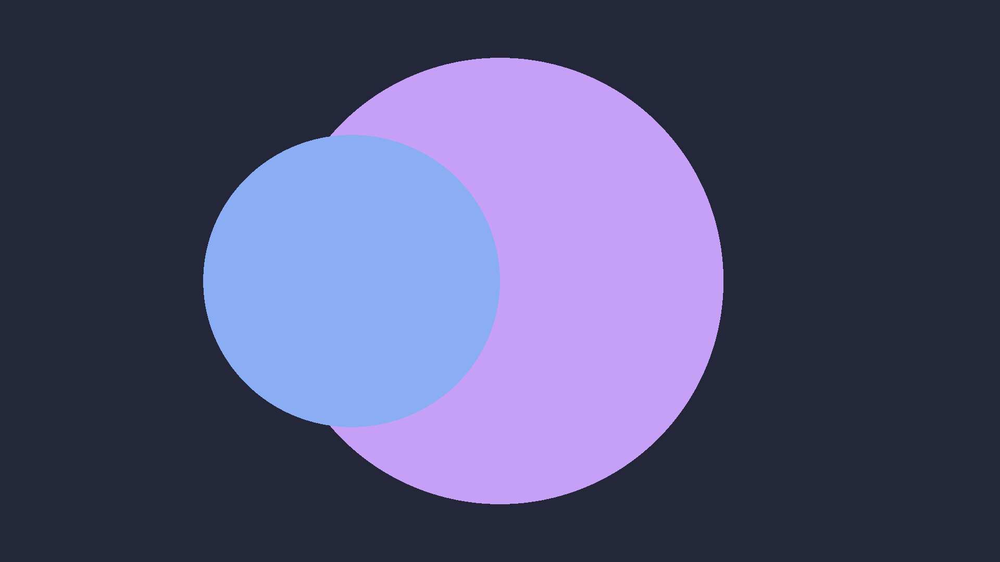
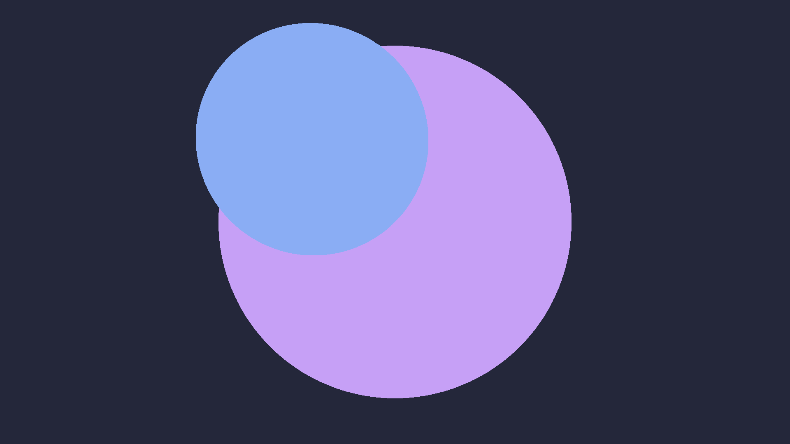
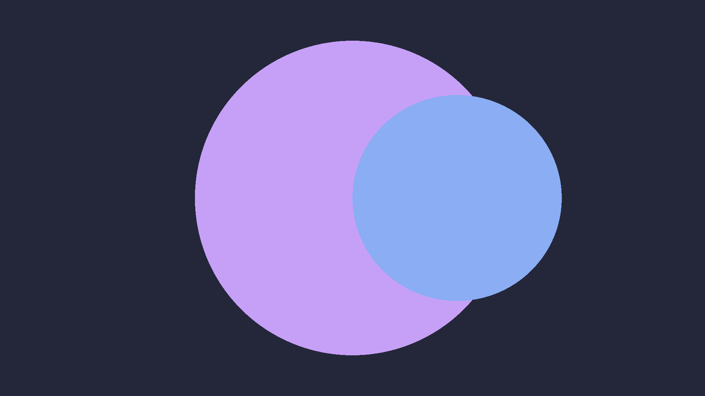
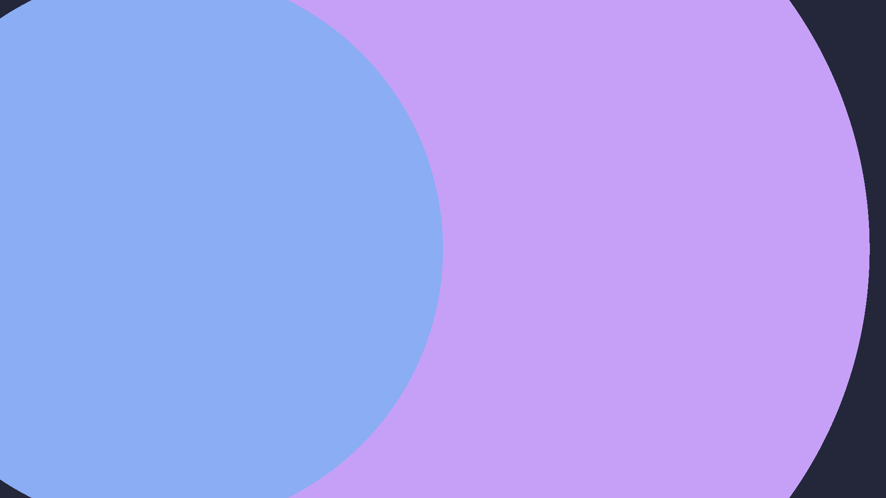
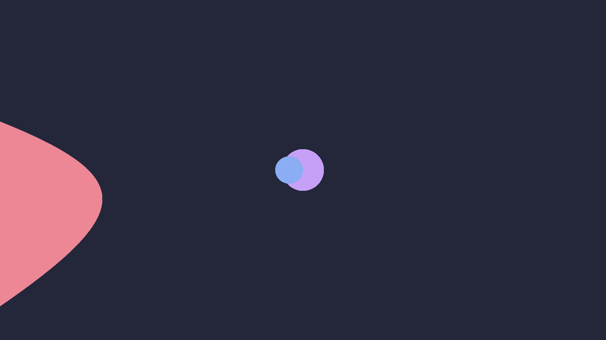
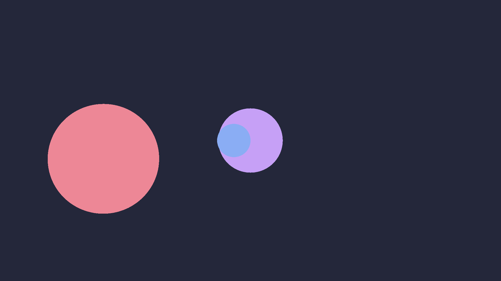
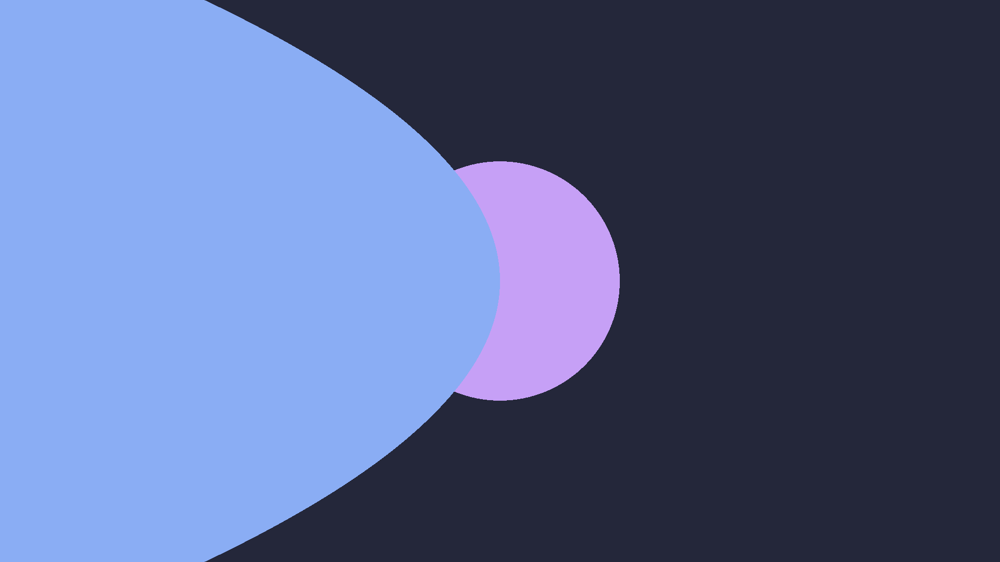

# Assignment 1a: Getting Started with Ray Casting

## Compiling
A Makefile is provided. Run `make` to compile.

## Running

```sh
./raytracer1a <file> 
```

It will generate an ASCII PPM image based on the input file and output it to *filename*.ppm.

When the program completes, you can view the result by opening *filename*.ppm with a program that supports PPM images, such as GIMP.
Alternatively, you can open it in a text editor to see the innards of the PPM file in beautiful ASCII characters.

## Config File
The program requires an input file containing lines that determine the output image:
```
imsize <w> <h> // dimensions of the image
eye <x> <y> <z> // position of the camera
viewdir <x> <y> <z> // viewing direction
updir <x> <y> <z> // vector indicating the up direction
hfov <i> // horizontal field of view
bkgcolor <r> <g> <b> // background color
```
For `updir` and `viewdir`, the program automatically normalizes the vectors.

Additionally, the user can set a material color with `mtlcolor <r> <g> <b>` and add spheres with `sphere <x> <y> <z> <r>`. Setting `mtlcolor` will set the color for all spheres declared afterward. To create a sphere with a different color, set `mtlcolor` again to change the color of all spheres that are declared after that declaration.

## Behavior
<div>
  
</div>
The above image is created with the file:

```
imsize 1920 1080
eye 0 0 0
viewdir 0 0 -1
hfov 60
updir 0 1 0
bkgcolor 0.141176471 0.152941176 0.22745098

mtlcolor 0.776470588 0.62745098 0.964705882
sphere 0 0 -8 2

mtlcolor 0.541176471 0.678431373 0.956862745
sphere -1 0 -6 1

mtlcolor 0.929411765 0.529411765 0.588235294
sphere -8 -1 -1 3
```
The following sections will modify this file to demonstrate the effects of the various parameters.

### Changes in `updir`
The user can rotate the scene by modifying the `updir` parameters.
As expected, inputting `updir 0 1 0` will make the camera upright. However, changing the x and y values of the `updir` will allow the camera to be rotated in any angle.
For example, setting the `updir` to `-1 1 0` will rotate the scene 45 degrees clockwise.
Alternatively, setting it to `0 -1 0` will flip the scene upside down.
Changing the `z` value will not have an effect on the rotation of the scene.

<div style="width:100%;">
  <figure style="width:360px;display:inline-block;vertical-align:top;">
    
    <figcaption>45° rotation using <code>updir -1 1 0</code></figcaption>
  </figure>
  <figure style="width:360px;display:inline-block;vertical-align:top;">
    
    <figcaption>180° rotation using <code>updir 0 -1 0</code></figcaption>
  </figure>
</div>

### Changes in `hfov`
The user can alter the horizontal field of view by modifying the `hfov` parameter.
Higher values will have a wider viewing angle, meaning that a wider area of the scene can fit within the viewing window.
This has two consequences. First, the content of the scene (especially in the middle of the viewing window) will appear further from the camera.
Second, the scene will appear more distorted, especially near the edges.
Inversely, a lower hfov will appear less distorted, but the image will appear zoomed in.

<div style="width:100%;">
  <figure style="width:360px;display:inline-block;vertical-align:top;">
    
    <figcaption>At 30 hfov, the image appears less distorted, but it appears much more zoomed in.</figcaption>
  </figure>
  <figure style="width:360px;display:inline-block;vertical-align:top;">
    
    <figcaption>At 150 hfov, the two spheres appear much further away, but you can now see a (<em>very</em> distorted) sphere that was not visible at 60 hfov.</figcaption>
  </figure>
</div>

### Adapting to Image Distortion
While `hfov` can alter the distortion at the cost of perceived distance, you can alter the camera's position with `eye` to counteract this. Lowering the hfov and moving the camera backward in the z direction will create an image that is not as distorted but just as close. Doing the opposite will create an image that is extremely distorted, but the objects will still appear just as close.

<div style="width:100%;">
  <figure style="width:360px;display:inline-block;vertical-align:top;">
    
    <figcaption>After moving back 50 units, the same circle from the 150 hfov image can be seen, but it's much less distorted.</figcaption>
  </figure>
  <figure style="width:360px;display:inline-block;vertical-align:top;">
    
    <figcaption>After moving forward 5 units, the blue sphere looks extremely distorted at 150 hfov.</figcaption>
  </figure>
</div>