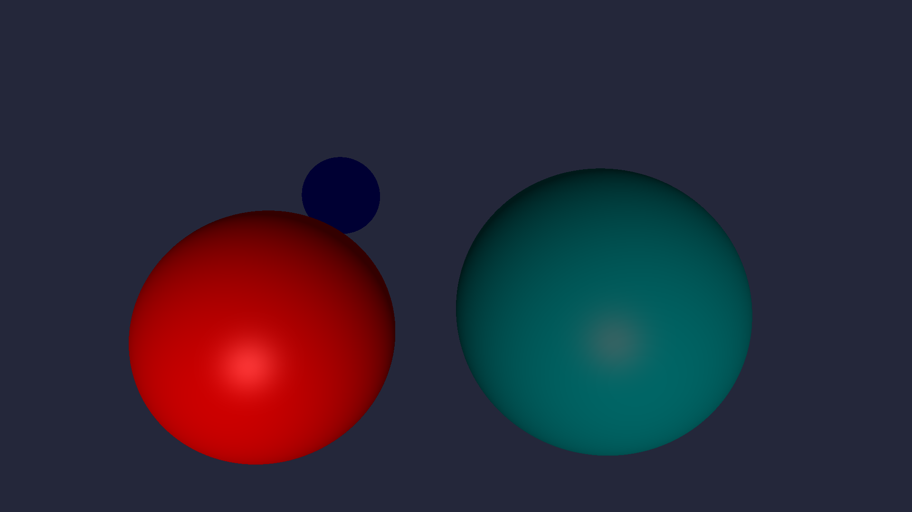

# Assignment 1b: Light and Shadow

## Compiling
A Makefile is provided. Run `make` to compile.

## Running

```sh
./raytracer1b <file> 
```

It will generate an ASCII PPM image based on the input file and output it to *filename*.ppm.

When the program completes, you can view the result by opening *filename*.ppm with a program that supports PPM images, such as GIMP.
Alternatively, you can open it in a text editor to see the innards of the PPM file in beautiful ASCII characters.

## Config File
The program requires an input file containing lines that determine the output image:
```
imsize <w> <h> // dimensions of the image
eye <x> <y> <z> // position of the camera
viewdir <x> <y> <z> // viewing direction
updir <x> <y> <z> // vector indicating the up direction
hfov <i> // horizontal field of view
bkgcolor <r> <g> <b> // background color
```
For `updir` and `viewdir`, the program automatically normalizes the vectors. 
For `bkgcolor` and `mtlcolor`, all rgb values are clamped between 0 and 1. 

Additionally, the following optional inputs can be included:
```
mtlcolor <Odr> <Odg> <Odb> <Osr> <Osg> <Osb> <ka> <kd> <ks> <n>
light <x> <y> <z> <w> <i>
sphere <x> <y> <z> <r>
```
Defining `mtlcolor` will affect the color of all spheres defined afterwards. 
So, to have spheres with differing colors, `mtlcolor` can be defined between them to change the spheres that follow. 
It takes as parameters the diffuse color, the specular highlight color, the coefficients for the ambient, diffuse, and specular components, and the specular exponent.

## Behavior
<div style="text-align:center">
  
</div>
The above image is created with the file:

```
imsize 1920 1080
eye 0 0 2
viewdir 0 -1 -3
hfov 80
updir 0 1 0
bkgcolor 0.141176471 0.152941176 0.22745098

mtlcolor 1 0 0 1 1 1 0.2 0.6 0.2 50
sphere -3 -4 -6 2

mtlcolor 0 0 1 1 1 1 0.2 0.6 0.2 50
sphere -3 -3 -12 1

mtlcolor 0 0.5 0.5 1 1 1 0.2 0.6 0.2 50
sphere 2.5 -4 -7 2.5
```
The following sections will modify this file to demonstrate the effects of the various parameters.

### Directional Lights vs Point Lights
A directional light acts in one specific direction and is represented as a vector (x, y, z, 0). For instance, inputting `light 0 0 -1 0 1` will create a directional light going in the -z direction:

<figure style="width:360px;margin-left:auto;margin-right:auto">
  
  <figcaption>The blue sphere is not lit because the red sphere casts a shadow over it, so the light will not reach it.</figcaption>
</figure>

Alternatively, a point light acts in all directions surrounding its coordinates and is represented by a point (x, y, z, 1). For instance, inputting `light -3 -3.5 -9 1 1` will create a point light at (-3, -3.5, -9):

<figure style="width:360px;margin-left:auto;margin-right:auto">
  
  <figcaption>The red sphere does not cast a shadow on the blue sphere since the point light is between both spheres.</figcaption>
</figure>

### More Lighting Quirks

Each light also has an intensity value `i`. `i` is a scalar between 0 and 1 that affects the degree to which a light can luminate objects. The previous examples each used an intensity value of one. At lower intensity values, a dimmer light can be produced:

<figure style="width:360px;margin-left:auto;margin-right:auto">
  
  <figcaption>Directional light <code>0 0 -1 0 0.3</code></figcaption>
</figure>

In addition, any number of directional or point lights can be combined to include multiple light sources in an image and generate interesting lighting conditions:

<figure style="width:360px;margin-left:auto;margin-right:auto">
  
  <figcaption>Some parts of the teal sphere are blocked from the point light but visible to the directional light. However, being in shadow of one light source does not prevent other light sources from lighting that area.</figcaption>
</figure>

### Material Color

The first 3 values of the `mtlcolor` attribute indicate the diffuse color. 
This affects the base color of each object, and changing these values is what made each sphere their own respective colors.
The diffuse color is used to calculate both the ambient component and the diffuse component of the total illumination at a given point. 

These components are further affected by their coefficients, `ka` and `kd`. 
`ka`, `kd`, and `ks` are scalars from 0 and 1 that function similarly to the intensity of a given light. Rather, it affects the amount of illumination for a given component. 
For example, while a low `kd` value will make unlit areas appear dark, a high `kd` value will be closer to the diffuse color:

<figure style="width:360px;margin-left:auto;margin-right:auto">
  
  <figcaption>The blue sphere is given a <code>ka</code> value of 1.</figcaption>
</figure>

Meanwhile, the `kd` coefficient will affect the intensity of the areas of the sphere that are lit. 
A low value will keep the sphere as dim as the parts in shadow, while a high value will intensely light the sphere.

<div style="display:inline-flex;flex-wrap:wrap;justify-content:center;width:100%;">
  <figure style="width:300px">
    
    <figcaption>The red sphere is given a <code>kd</code> value of 0.1.</figcaption>
  </figure>
  <figure style="width:300px">
    
    <figcaption>The red sphere is given a <code>kd</code> value of 1.</figcaption>
  </figure>
</div>

---

The second set of values for `mtlcolor` indicate the color of the specular highlight, and changing them will change how the sphere reflects light:

<figure style="width:300px;margin-left:auto;margin-right:auto">
  
  <figcaption>The teal sphere's specular highlight is set to red.</figcaption>
</figure>

Though the specular highlight is visibly different, one may want to make it more visible. 
Much like `ka` and `kd`, `ks` will scale the intensity of the specular component. The previous images have the `ks` value set to 0.2 for all spheres. Here's what the teal sphere would look like with a `ks` of 1:

<figure style="width:300px;margin-left:auto;margin-right:auto">
  
  <figcaption>The teal sphere's red specular highlight is now much more visible!</figcaption>
</figure>

Additionally, `mtlcolor` includes a specular exponent `n` that affects the size of the specular highlight. 
High values will lead to a smaller highlight, while low values will lead to a larger highlight.

<div style="display:inline-flex;flex-wrap:wrap;justify-content:center;width:100%">
  <figure style="width:300px;">
    
    <figcaption>The teal sphere is given an <code>n</code> value of 1.</figcaption>
  </figure>
  <figure style="width:300px;">
    
    <figcaption>The teal sphere is given an <code>n</code> value of 1000.</figcaption>
  </figure>
</div>

